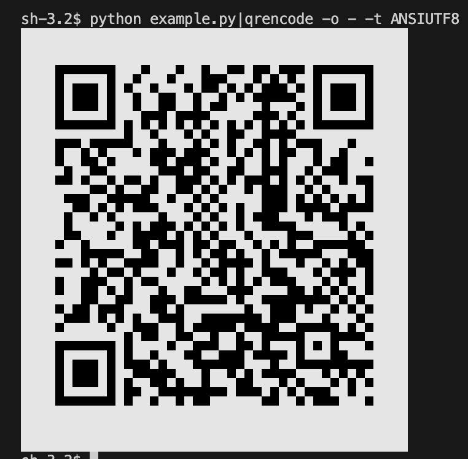

# MaeManeeQR

A Python tool for generating SCB MaeManee QR Codes.

- [MaeManeeQR](#maemaneeqr)
  - [Requirements](#requirements)
  - [Installation](#installation)
  - [Usage](#usage)
  - [Example](#example)
  - [Testing](#testing)
  - [Code Formatting and Pre-Commit Hooks](#code-formatting-and-pre-commit-hooks)
  - [License](#license)

## Requirements

- Python 3.9 or higher (tested on Python 3.9, 3.10, and 3.11)

## Installation

1. Clone this repository:

   ```bash
   git clone https://github.com/Shayennn/MaeManeeQR.git
   cd MaeManeeQR
   ```

2. Install the required dependencies:

   ```bash
   pip install -r requirements.txt
   ```

## Usage

Below is a simple example that generates a MaeManee QR code string.

```python
from MaeManeeQR import MaeManeeQR

# Your Shop ID from the MaeManee App
shopID = '014000000820910'

# A reference message to include in the transaction details
ref = 'ShayennnTestQR'

# Create the MaeManeeQR object
mmn = MaeManeeQR.MaeManeeQR(shopID, ref)

# Set the amount for the QR Code payment
mmn.setAmount(168.88)

# Print the QR code content (can be used with QR code generators)
print(mmn)
```

## Example

See the [example.py](example.py) file for a more detailed example.

```bash
python example.py|qrencode -o - -t ANSIUTF8
```



## Testing

Tests are written using [pytest](https://docs.pytest.org/). To run the test suite, simply execute:

```bash
pytest
```

## Code Formatting and Pre-Commit Hooks

This repository uses [Black](https://github.com/psf/black) for code formatting and [pre-commit](https://pre-commit.com/) to ensure code quality checks run automatically before each commit.

**To set up pre-commit hooks:**

1. Install `pre-commit` if you haven't already:

   ```bash
   pip install pre-commit
   ```

2. Install the hooks defined in `.pre-commit-config.yaml`:

   ```bash
   pre-commit install
   ```

From now on, when you run `git commit`, Black and other checks will run automatically. If any formatting issues are found, they will be fixed, and you can commit again.

**To format code manually:**

```bash
black --line-length=100 --target-version=py311 .
```

## License

[The MIT License](LICENSE)
